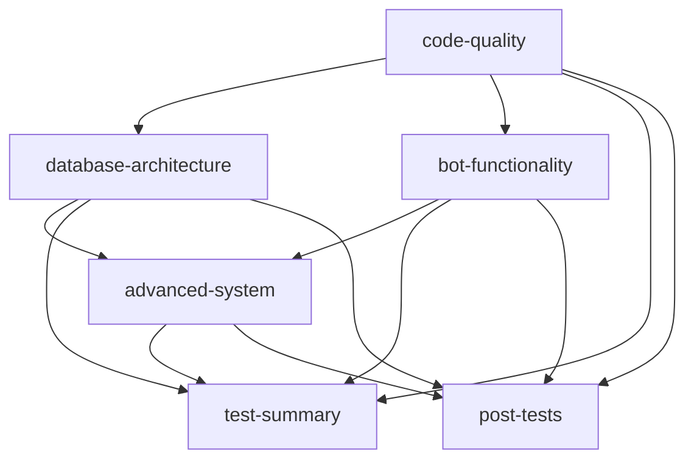

# Test Workflow Restructure Summary

## 🎯 Objective Completed
Successfully broke out the unit tests into separate, focused jobs that make it easy to pinpoint which test suites pass or fail.

## 📊 New Test Structure

### 1. **Code Quality & Validation**
- **Purpose**: Basic code linting and validation tests
- **Tests**: `test_validation.py`
- **Dependencies**: None (runs first)
- **Emoji**: 🔍 ✅

### 2. **Database Architecture Tests** 
- **Purpose**: All database-related functionality testing
- **Tests**: 
  - `test_database_v2.py` (Database v2.0.0 Architecture)
  - `test_database_integration.py` (Database Integration)
  - `test_database_performance.py` (Database Performance)
- **Dependencies**: `code-quality`
- **Emoji**: 🗄️ 🔗 ⚡

### 3. **Bot Functionality Tests**
- **Purpose**: Core bot functionality and modular systems
- **Tests**:
  - `test_participation_bot.py` (Participation Bot)
  - `test_modular_system.py` (Modular System Architecture)
- **Dependencies**: `code-quality`
- **Emoji**: 🤖 🧩

### 4. **Advanced System Tests**
- **Purpose**: Advanced components and integration testing
- **Tests**: `test_advanced_system.py`
- **Dependencies**: `database-architecture` AND `bot-functionality`
- **Emoji**: 🚀

### 5. **Test Summary & Results**
- **Purpose**: Generate comprehensive test results summary
- **Dependencies**: All test jobs
- **Features**: Step-by-step summary table in GitHub UI

### 6. **Post-Test Actions**
- **Purpose**: Automated label management and PR commenting
- **Dependencies**: All test jobs
- **Features**: 
  - Adds `tests good` label when all pass
  - Adds `tests failed` label when any fail
  - Posts detailed results table as PR comment
  - Integrates with deployment workflow

## 🔗 Test Dependencies

## ✨ Key Benefits

1. **Granular Visibility**: Each test suite runs as a separate job with clear success/failure status
2. **Parallel Execution**: Independent test suites run concurrently for faster feedback
3. **Logical Dependencies**: Tests that depend on core functionality run after foundational tests
4. **Automated Workflow Integration**: Results automatically trigger deployment pipeline via labels
5. **Clear Reporting**: Detailed summaries and tables in both GitHub UI and PR comments

## 🎉 Integration with Deployment Pipeline

- **✅ All Tests Pass** → Adds `tests good` label → Enables deployment workflows
- **❌ Any Test Fails** → Adds `tests failed` label → Blocks deployment until fixed
- **📊 Detailed Reports** → Step summary + PR comments with result tables

This structure makes it immediately clear which specific component has issues, dramatically improving debugging efficiency and deployment confidence!
